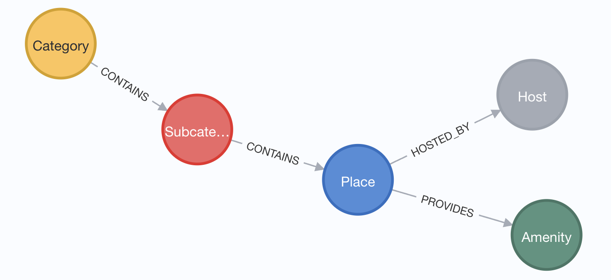

= Spring AI application with Neo4j and Pet Travel Data

This is an example application using Spring AI, Neo4j, and pet travel data from a few APIs.

== Data set

Data is maintained and pulled from public data sources. Load scripts and more information is available in https://github.com/JMHReif/graph-demo-datasets/tree/main/pet-travel[this data set Github repository^]. An example of the data model is shown below.



For this project, we are focusing on how GraphRAG works.

== Running and testing this project

To run the application, you will need the following:

* Neo4j database credentials. You can set these in the `application.properties` file or as environment variables on the machine.
* OpenAI API key: they offer a free tier that works for this.

Once that's set up and data is loaded, execute the application with `./mvnw spring-boot:run`.

You can test the `/rag` endpoint. Here are some ideas for example search terms:

```
http ":8080/rag?searchPhrase=quiet"

http ":8080/rag?searchPhrase=nature and pampering"

http ":8080/rag?searchPhrase=culture and history"

http ":8080/rag?searchPhrase=cultural food"

http ":8080/rag?searchPhrase=Tell me about places with social and culture"
```

*Note:* The above commands are using the https://httpie.io/[
HTTPie^] command line tool, but you can use `curl` similarly.

== Presentation

PDF versions of accompanying presentations are published to SpeakerDeck.

* https://speakerdeck.com/jmhreif/graphrag-for-java-developers-data-with-context[Atlanta JUG (April 2025)^]
* https://speakerdeck.com/jmhreif/graphrag-data-with-context[Arc of AI (March 2025)^]

== Resources
* Site: https://dev.neo4j.com/aura-java[Neo4j Aura^]
* Online training: https://graphacademy.neo4j.com/categories/llms/[Neo4j GraphAcademy LLM courses^]
* Documentation: https://docs.spring.io/spring-ai/reference/api/vectordbs/neo4j.html[Spring AI Neo4j Vector Store^]
* Documentation: https://platform.openai.com/docs/guides/embeddings[OpenAI Embeddings^]